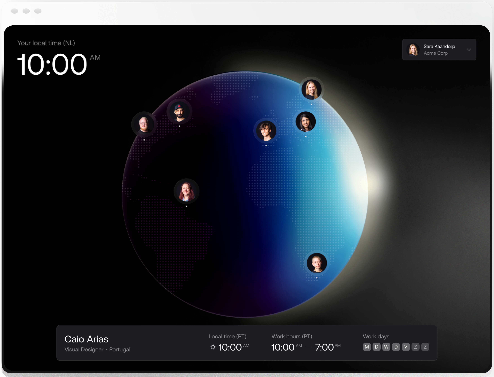

# Terrazone

Get a hold of your college work time and whereabouts with ease.

## ⚡ Features
- 3D Globe visualizing user's whereabouts.
- Get user working details in your local time
- Set your working time and place as private for team members only.

## 🗄️ Stack 
- Appwrite [Auth](https://appwrite.io/docs/products/auth) for user signing.
- Appwrite [Databases](https://appwrite.io/docs/products/databases) for storing users' information.
- Appwrite [Permissions](https://appwrite.io/docs/products/databases/permissions) and [Teams](https://appwrite.io/docs/products/auth/teams) for data safety.
- Appwrite [Function](https://appwrite.io/docs/products/functions) for executing server-side code logic.
- Appwrite [Buckets](https://appwrite.io/docs/products/storage) for storing user profile image.
- [Turbo](https://turbo.build/repo/docs) for build system.
- [Next.js](https://nextjs.org/) for frontend.
- [Vercel](https://vercel.com/) for static hosting
- [Tailwind CSS](https://tailwindcss.com/) for styling.

### Footnote
Terrazone heavily relies on the Appwrite permission system.
Appwrite permission system gives the ability to use the API in a seeming way. The documents being returned from the API request going through the permission system and any document that won't match the current user (whether it's a guest or logged-in user) won't be fetched.

Doing so helps to short the amount of time requires for development.
